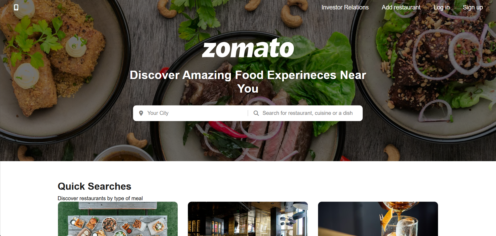

# Zomato Clone Website 🍔

A modern and responsive Zomato-inspired food delivery website built using HTML and CSS.  
This project was created to improve my frontend development skills and understand how real-world websites are designed.

## 🚀 Features

- Responsive modern UI
- Beautiful landing page
- Food category sections
- Restaurant collection cards
- Search bar design
- Hover animations and effects
- Mobile-friendly layout
- Attractive footer section
- Font Awesome icons and Google Fonts integration

## 🛠️ Technologies Used

- HTML5
- CSS3
- Font Awesome Icons
- Google Fonts

## 📚 What I Learned

Through this project, I improved my understanding of:

- HTML page structure
- CSS styling and positioning
- Flexbox and Grid layout
- Responsive web design
- Hover effects and transitions
- Building realistic website layouts

## 🔥 Future Improvements

I am planning to make this website more dynamic by adding:

- JavaScript functionality
- Working search feature
- Login/Signup popup
- Dark mode
- Interactive buttons
- Restaurant filtering system
---

This project was built for learning and practice purposes.

## 📸 Project Preview

